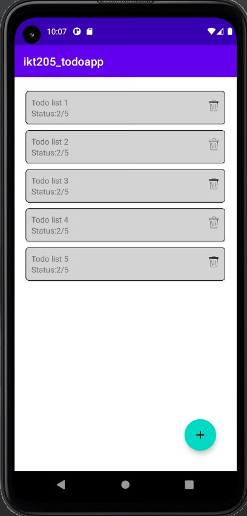
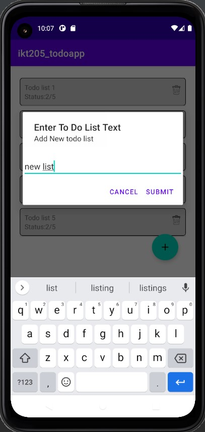
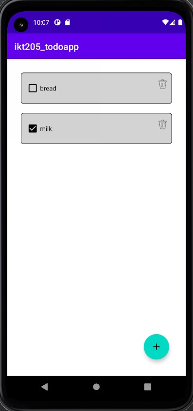
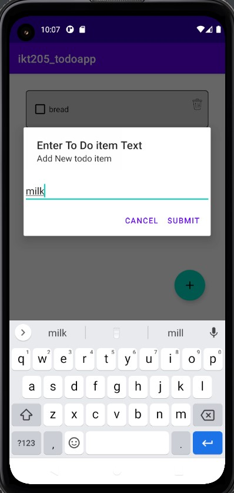

Read Me:

This is a simple To Do list application that allows users to create To Do lists and fill them with
To Do items.

Link to APK
  - The APK file is deployed through firebase, and can be accessed through the link bellow:  https://appdistribution.firebase.dev/i/0625355bbc0874a7

  
Here are screenshots of the application:

First screen:  
  It allows you to view, add and delete items.

  

First screen add list dialog:  
  This dialog allows user to create a list.

  

Second screen:  
  This screen shows the todo items.  
  The user can mark them as done and undone by clicking on the checkbox. 
  Items can also be deleted.

  

Second screen add item dialog:  
  This dialog allows user to create an item.

https://github.com/UiA-IKT-205/saidMagomedLetsjijevitsjEvmurzajev
